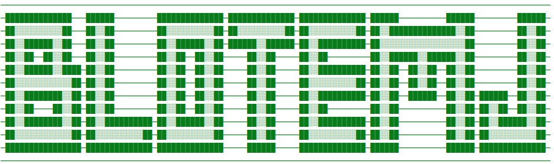

# 🔥🔥🔥专注于YOLO改进-blotemJ陆小马



## 介绍

**模型多样化**: 基于不同网络模块构建不同检测网络模型。

**模块组件化**: 帮助用户自定义快速组合Backbone、Neck、Head，使得网络模型多样化，助力科研改进检测算法、模型改进，网络排列组合🏆。构建强大的网络模型。

**统一模型代码框架、统一应用方式、统一调参、统一改进、集成多任务、易于模块组合、构建更强大的网络模型**。

内置集成YOLO等模型网络结构...
集成多种检测算法 和 相关多任务模型 使用统一模型代码框架。便于科研者用于论文算法模型改进，模型对比，实现网络组合多样化。
包含轻量化模型和精度更高的模型，根据场景合理选择，在精度和速度俩个方面取得平衡。
同时该库支持解耦不同的结构和模块组件，让模块组件化，通过组合不同的模块组件，用户可以根据不同数据集或不同业务场景自行定制化构建不同检测模型。


______________________________________________________________________

### 🌟 To Do

- 支持多任务, 包括 目标检测、分类、分割、姿态估计、人脸检测、目标跟踪 等任务

______________________________________________________________________

### 主要特性🚀

🚀支持更多的YOLO系列算法模型改进(持续更新...)

🚀支持更多的网络模型组件

🚀支持更多Backbone

- CSPDarkNet系列
- HorNet系列
- ResNet系列
- RegNet 系列
- ShuffleNet系列
- Ghost系列
- MobileNet系列
- EfficientNet系列
- ConvNext系列
- RepLKNet系列
- 重参数化系列
- RepVGG系列
- RepMLP系列
- ACNet系列
- RepConv系列
- OREPA系列
- Mobileone系列
- 自注意力Transformer系列
- MobileViT系列
- BoTNet-Transfomrer
- CoTNet-Transfomrer
- Swin-Transfomrer
- Swin-Transfomrer(v2)
- 以及其他trans系列
  持续更新中🎈🚀🚀🚀

🚀支持更多Neck

- FPN
- PANet
- RepPAN
- BiFPN
- CSPPAN
- SlimNeck
- ELANPAN  
  持续更新中🎈

🚀支持更多检测头Head

- YOLOv4、YOLOv5 Head检测头;
- YOLOR 隐式学习Head检测头;
- YOLOX的解耦合检测头Decoupled Head、DetectX Head;
- 自适应空间特征融合 检测头ASFF Head;
- YOLOv6-v2.0 Efficient decoupled head;
- YOLOv7检测头IAuxDetect Head, IDetect Head等;
- 其他不同检测头

🚀支持更多即插即用的注意力机制Attention

- 在网络任何部分即插即用式使用注意力机制
- Self Attention
- Contextual Transformer
- Bottleneck Transformer
- S2-MLP Attention
- SK Attention
- CBAM Attention
- SE Attention
- Coordinate attention
- NAM Attention
- GAM Attention
- ECA Attention
- Shuffle Attention
- CrissCrossAttention
- Coordinate attention
- SOCAttention
- SimAM Attention
  持续更新中🎈

🚀更多空间金字塔池化结构

- SPP
- SPPF
- ASPP
- RFB
- SPPCSPC
- SPPFCSPC
- SimSPPF
  持续更新中🎈

🚀支持更多Loss

- ComputeLoss
- ComputeLoss(v5)
- ComputeLoss(v6)
- ComputeLoss(X)
- ComputeLossAuxOTA(v7)
- ComputeLossOTA(v7)
- ComputeNWDLoss
- 其他Loss

🚀支持 Anchor-base 和 Anchor-Free

- 🌟 YOLOv5、YOLOv7、YOLOv3、YOLOv4、YOLOR、ScaledYOLOv4、PPYOLO、PPYOLOv2、Improved-YOLOv5、Improved-YOLOv7

- 🌟 YOLOX、YOLOv6 (Paper)、PPYOLOE、PPYOLOE+

🚀支持多种标签分配策略

- Multi Anchor策略
- YOLOv5 标签分配策略
- SimOTA 标签分配策略
- YOLOv7 标签分配策略
- AutoAssign 标签分配策略🌟
- Dual Weighting 标签分配策略🌟
- FreeAnchor 标签分配策略🌟
- 其他改进的标签分配策略
  持续更新中🎈

🚀支持加权框融合(WBF)

🚀 内置多种网络模型模块化组件  
Conv, GhostConv, Bottleneck, GhostBottleneck, SPP, SPPF, DWConv, MixConv2d, Focus, CrossConv,BottleneckCSP, C3, C3TR,
C3SPP, C3Ghost, C3HB, C3RFEM, MultiSEAM, SEAM, C3STR, SPPCSPC, RepConv, BoT3, Air, CA, CBAM, Involution, Stem, ResCSPC,
ResCSPB, ResXCSPB, ResXCSPC, BottleneckCSPB, BottleneckCSPC, ASPP, BasicRFB, SPPCSPC_group, HorBlock, CNeB,C3GC ,C3C2,
nn.ConvTranspose2d, DWConvblock, RepVGGBlock, CoT3, ConvNextBlock, SPPCSP, BottleneckCSP2, DownC, BottleneckCSPF,
RepVGGBlock, ReOrg, DWT, MobileOne,HorNet...等详细代码 **./models/common.py文件** 内

🚀支持更多IoU损失函数

- CIoU
- DIoU
- GIoU
- EIoU
- SIoU
- alpha IOU  
  持续更新中🎈

🚀支持更多NMS

- NMS
- Merge-NMS
- Soft-NMS
- CIoU_NMS
- DIoU_NMS
- GIoU_NMS
- EIoU_NMS
- SIoU_NMS
- Soft-SIoUNMS、Soft-CIoUNMS、Soft-DIoUNMS、Soft-EIoUNMS、Soft-GIoUNMS等;    
  持续更新中🎈

🚀支持更多数据增强

- Mosaic、Copy paste、Random affine(Rotation, Scale, Translation and Shear)、MixUp、Augment HSV(Hue, Saturation,
  Value、Random horizontal flip

🚀支持加载YOLOv3、YOLOv4、YOLOv5、YOLOv7、YOLOR、Scaled_YOLO等网络的官方预训练权重进行迁移学习

🚀 YOLO系列网络模型热力图可视化(GardCAM、GardCAM++等)
支持YOLOv3、、YOLOv3-SPP、YOLOv4、YOLOv5、YOLOR、YOLOv7Scaled_YOLOv4、TPH-YOLO、SPD-YOLO以及自定义网络模型等模型

______________________________________________________________________

## 使用🍉

### 安装

在**Python>=3.7.0**的环境中克隆版本仓并安装 requirements.txt，包括**PyTorch>=1.7**。

```bash
$ git clone https://gitee.com/blotemj/lxm.git  # 克隆
$ cd lxm
$ pip install -r requirements.txt  # 安装
```

### 训练

```bash
$ python train.py --data coco128.yaml --cfg configs/yolov5/yolov5s.yaml #默认为yolo
```

### 推理

`detect.py`在各种数据源上运行推理, 并将检测结果保存到`runs/detect`目录。

```bash
$ python detect.py --source 0  # 网络摄像头
                          img.jpg  # 图像
                          vid.mp4  # 视频
                          path/  # 文件夹
                          path/*.jpg  # glob
```

### 融合

如果您使用不同模型来推理数据集，则可以使用 wbf.py文件 通过加权框融合来集成结果。
您只需要在 wbf.py文件 中设置 img 路径和 txt 路径。

```bash
$ python wbf.py
```

### Performance

| Model             | size<br><sup>(pixels) | mAP<sup>val<br>0.5:0.95 | mAP<sup>val<br>0.5 | Speed<br><sup>CPU b1<br>(ms) | Speed<br><sup>V100 b1<br>(ms) | Speed<br><sup>V100 b32<br>(ms) | params<br><sup>(M) | FLOPs<br><sup>@640 (B) | Weights                                                                              |
|-------------------|-----------------------|-------------------------|--------------------|------------------------------|-------------------------------|--------------------------------|--------------------|------------------------|--------------------------------------------------------------------------------------|
| YOLOv5n           | 640                   | 28.0                    | 45.7               | **45**                       | **6.3**                       | **0.6**                        | **1.9**            | **4.5**                | [YOLOv5n](https://github.com/ultralytics/yolov5/releases/download/v6.1/yolov5n.pt)   |
| YOLOv5s           | 640                   | 37.4                    | 56.8               | 98                           | 6.4                           | 0.9                            | 7.2                | 16.5                   | [YOLOv5s](https://github.com/ultralytics/yolov5/releases/download/v6.1/yolov5s.pt)   |
| YOLOv5m           | 640                   | 45.4                    | 64.1               | 224                          | 8.2                           | 1.7                            | 21.2               | 49.0                   | [YOLOv5m](https://github.com/ultralytics/yolov5/releases/download/v6.1/yolov5m.pt)   |
| YOLOv5l           | 640                   | 49.0                    | 67.3               | 430                          | 10.1                          | 2.7                            | 46.5               | 109.1                  | [YOLOv5l](https://github.com/ultralytics/yolov5/releases/download/v6.1/yolov5l.pt)   |
| YOLOv5x           | 640                   | 50.7                    | 68.9               | 766                          | 12.1                          | 4.8                            | 86.7               | 205.7                  | [YOLOv5x](https://github.com/ultralytics/yolov5/releases/download/v6.1/yolov5x.pt)   |
|                   |                       |                         |                    |                              |                               |                                |                    |                        |                                                                                      |
| YOLOv5n6          | 1280                  | 36.0                    | 54.4               | 153                          | 8.1                           | 2.1                            | 3.2                | 4.6                    | [YOLOv5n6](https://github.com/ultralytics/yolov5/releases/download/v6.1/yolov5n6.pt) |
| YOLOv5s6          | 1280                  | 44.8                    | 63.7               | 385                          | 8.2                           | 3.6                            | 12.6               | 16.8                   | [YOLOv5s6](https://github.com/ultralytics/yolov5/releases/download/v6.1/yolov5s6.pt) |
| YOLOv5m6          | 1280                  | 51.3                    | 69.3               | 887                          | 11.1                          | 6.8                            | 35.7               | 50.0                   | [YOLOv5m6](https://github.com/ultralytics/yolov5/releases/download/v6.1/yolov5m6.pt) |
| YOLOv5l6          | 1280                  | 53.7                    | 71.3               | 1784                         | 15.8                          | 10.5                           | 76.8               | 111.4                  | [YOLOv5l6](https://github.com/ultralytics/yolov5/releases/download/v6.1/yolov5l6.pt) |
| YOLOv5x6<br>+ TTA | 1280<br>1536          | 55.0<br>**55.8**        | 72.7<br>**72.7**   | 3136<br>-                    | 26.2<br>-                     | 19.4<br>-                      | 140.7<br>-         | 209.8<br>-             | [YOLOv5x6](https://github.com/ultralytics/yolov5/releases/download/v6.1/yolov5x6.pt) |

<details><summary> <b>Expand</b> </summary>

* The original version was created based on YOLOv5(6.1)

</details>

______________________________________________________________________

| Model               | size<br><sup>(pixels) | mAP<sup>val<br>0.5:0.95 | mAP<sup>val<br>0.5 | deconv kernel size<br><sup> | Speed<br><sup>V100 b1<br>(ms) | Speed<br><sup>V100 b32<br>(ms) | params<br><sup>(M) | FLOPs<br><sup>@640 (B) |
|---------------------|-----------------------|-------------------------|--------------------|-----------------------------|-------------------------------|--------------------------------|--------------------|------------------------|
| YOLOv5s             | 640                   | 33.7                    | 52.9               | -                           | **5.6**                       | **2.2**                        | **7.23**           | **16.5**               |
| YOLOv5s-deconv-exp1 | 640                   | 33.4                    | 52.5               | 2                           | **5.6**                       | 2.4                            | 7.55               | 18.2                   |
| YOLOv5s-deconv-exp2 | 640                   | **34.7**                | **54.2**           | 4                           | 5.8                           | 2.5                            | 8.54               | 23.2                   |

<details><summary> <b>Expand</b> </summary>

* The training process depends on 4xV100 GPU

```
# train
python -m torch.distributed.run --nproc_per_node 4 train.py --device 0,1,2,3 --data data/coco.yaml --hyp data/hyps/hyp.scratch-low.yaml  --cfg path/to/model.yaml --batch 512 --epochs 300 --weights ''
# val
python val.py --verbose --data data/coco.yaml --conf 0.001 --iou 0.65 --batch 1 --weights path/to/model.pt
```

* There is a gap between the mAP of YOLOv5s and the official one, here is just for comparison

</details>

______________________________________________________________________

| Model          | size<br><sup>(pixels) | mAP<sup>val<br>0.5:0.95 | mAP<sup>val<br>0.5 | params<br><sup>(M) | FLOPs<br><sup>@640 (B) |
|----------------|-----------------------|-------------------------|--------------------|--------------------|------------------------|
| YOLOv5s        | 640                   | 37.4                    | 56.6               | **7.226**          | **16.5**               |
| YOLOv5s-deconv | 640                   | **37.8**                | **57.1**           | 7.232              | **16.5**               |

<details><summary> <b>Expand</b> </summary>

* tested the 4x4 depthwise-separable deconv by setting the groups as input_channel
* their params number and FLOPS are nearly the same while the new model's mAP is about 0.4 higher than the origin.

</details>

______________________________________________________________________

| Model                 | size<br><sup>(pixels) | mAP<sup>val<br>0.5:0.95 | mAP<sup>val<br>0.5 | params<br><sup>(M) | FLOPs<br><sup>@640 (B) |
|-----------------------|-----------------------|-------------------------|--------------------|--------------------|------------------------|
| YOLOv5s               | 640                   | 37.2                    | 56.0               | **7.2**            | **16.5**               |
| YOLOv5s-C3GC-backbone | 640                   | **37.7**                | **57.3**           | 7.5                | 16.8                   |

<details><summary> <b>Expand</b> </summary>

* The original version was created based on YOLOv5-6.0

</details>

______________________________________________________________________

## 说明

定制python、java、c、c++、app、html、计算机相关作业、软件网站代写指导帮忙、电脑提速优化
请私信公号中提醒联系协商时间等

如有需要请提前准备远程连接软件
ToDesk官网下载或网盘下载ToDesk_4.7.2.1

链接：https://pan.baidu.com/s/1AkZ8DGP5dbDeU7naH6v7Gw?pwd=1024
提取码：1024

开发环境
JDK1.8 以上
IntelliJ IDEA
Maven
tomcat8 以上
Node.js
Redis 7.0
MySQL 5.7or8
微信开发者工具
AndroidStudio
navcat12以上

资源获取渠道说明

百度搜blotemj不迷路
公号众、b站：陆小马
CSDN博客：https://blotemj.blog.csdn.net/
面包多：https://mbd.pub/o/blotemj


更新一些资料，录一些相关视频均在以上平台发布敬请期待。。。
