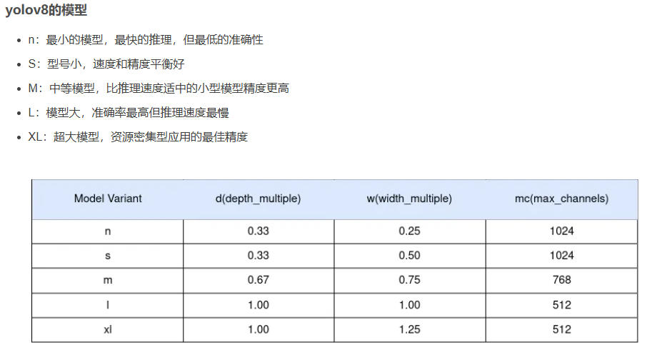

神经网络
特征提取过程，学习过程，参数优化过程，模型结构重要，基本神经元相同，怎么链接
权重
不断优化权重过程，
激活函数
注意力
增加权重，减少权重

在YOLO（You Only Look Once）算法中，张量（Tensor）是一个核心概念，它代表了算法处理过程中数据的基本形式。具体来说，张量在YOLO中可以理解为多维数组，用于存储和传递图像数据、特征图（feature maps）、检测结果等信息。

### YOLO中的张量，特征图

1. **输入张量**：
   - 在YOLO算法中，输入张量通常指的是经过预处理（如缩放、归一化等）后的图像数据。例如，在YOLOv1中，输入图像被resize到448x448的大小，并作为一个三维张量（height x width x channels，即448x448x3）送入网络。

2. **中间层张量**：
   - 在CNN（卷积神经网络）的每一层中，都会输出一个或多个张量，这些张量代表了图像经过该层处理后的特征图。这些特征图可能包含了图像的边缘、纹理、形状等信息，并且随着网络层数的增加，特征图的抽象级别也会逐渐提高。

3. **输出张量**：
   - YOLO算法的输出张量包含了检测结果。具体来说，YOLO将输入图像划分为多个网格（grid），并为每个网格预测多个边界框（bounding box）及其置信度和类别概率。这些预测结果以张量的形式输出，其中包含了边界框的位置（x, y, width, height）、置信度以及类别概率等信息。

### YOLO输出张量的具体结构

以YOLOv1为例，其输出张量的结构通常为7x7x30，这里的7x7对应输入图像被划分的网格数量，而30则代表了每个网格预测的信息维度：

- **2个边界框的位置**：每个边界框需要4个数值来表示其位置（x, y, width, height），因此两个边界框共需要8个数值。
- **2个边界框的置信度**：每个边界框有一个置信度值，表示该边界框内存在目标的概率以及边界框的准确度（通过IOU计算）。
- **20个类别概率**：YOLOv1支持识别20种不同的对象，因此每个网格会预测一个20维的向量，表示该网格位置存在任一种对象的概率。

### 总结

在YOLO算法中，张量作为数据的基本形式，贯穿了整个处理流程。从输入图像到中间层的特征图，再到最终的检测结果，都是通过张量来表示和传递的。通过对这些张量的处理和分析，YOLO算法能够实现对图像中目标的快速、准确检测。

### 模型大小
depth_multiple: 0.33  # model depth multiple
width_multiple: 0.25  # layer channel multiple


### 锚框
anchors:
  - [10,13, 16,30, 33,23]  # P3/8
  - [30,61, 62,45, 59,119]  # P4/16
  - [116,90, 156,198, 373,326]  # P5/32

在目标检测任务中，`anchors`（锚框）是一组预设的边界框，用于帮助模型预测目标的实际边界框。这些锚框具有不同的尺寸和宽高比，以便能够覆盖图像中不同大小和形状的目标。在您提供的例子中，`anchors`被分为三个列表，每个列表对应不同的特征图层级（P3、P4、P5），这些层级通常是通过特征金字塔网络（Feature Pyramid Network, FPN）或类似结构生成的，具有不同的空间分辨率。

- **P3/8**：这个层级对应的特征图空间分辨率是输入图像的1/8（即特征图的尺寸是输入图像尺寸的1/8）。这里的锚框尺寸较小，适合检测图像中的小目标。列表中的锚框尺寸和宽高比分别为`[10,13, 16,30, 33,23]`，注意这里列出的是锚框的宽度和高度（或反之，具体取决于定义方式），而不是直接的宽高比。

- **P4/16**：这个层级对应的特征图空间分辨率是输入图像的1/16。锚框尺寸适中，适合检测中等大小的目标。列表中的锚框尺寸和宽高比分别为`[30,61, 62,45, 59,119]`。

- **P5/32**：这个层级对应的特征图空间分辨率是输入图像的1/32。锚框尺寸较大，适合检测图像中的大目标。列表中的锚框尺寸和宽高比分别为`[116,90, 156,198, 373,326]`。

在实际的目标检测模型中，如YOLO系列、SSD等，这些锚框会作为预测目标边界框的起点。模型会学习如何调整这些锚框的位置、尺寸和宽高比，以更准确地匹配图像中的实际目标。

值得注意的是，锚框的选择和设置对模型的性能有很大影响。合理的锚框配置可以提高模型的检测精度和效率。因此，在训练目标检测模型时，通常需要根据具体任务和数据集的特点来选择合适的锚框尺寸和宽高比。

### 模块
Conv,
C3, 
ACmix,
SPPF,
Upsample,
Concat,
CBAM,
Detect,
mobilenetv3_bneck,
以下是对Conv、C3、ACmix、SPPF、Upsample、Concat、CBAM、Detect和mobilenetv3_bneck这些深度学习组件或技术的详细解释：

### 1. Conv（卷积）

**定义**：卷积是一种定义在两个函数（f 和g）上的数学操作，旨在产生一个新的函数。在深度学习中，尤其是卷积神经网络（CNN）中，卷积层用于提取输入数据的特征。

**特性**：
- **权值共享**：不同的感受域共享同一权值，能够大大减少权重的数量。
- **局部连接**：卷积核（滤波器）与输入数据的局部区域相连接，以提取局部特征。
- **参数少**：由于权值共享和局部连接，卷积层的参数数量远少于全连接层。

**应用**：广泛用于图像识别、视频处理、自然语言处理等领域。

### 2. C3（可能指某种特定的卷积模块或网络结构）

**说明**：C3不是一个广泛认知的标准深度学习组件或技术名称。它可能指的是某个特定网络或框架中自定义的卷积模块。在YOLO系列模型中，有时可以看到类似C3、C4等命名的模块，这些通常是通过特定方式组合卷积层、残差连接等构成的复杂结构。

### 3. ACmix

**定义**：ACmix是一个创新的开源项目，它提出了一种新的融合自注意力（Self-Attention）和卷积的方法，旨在提升计算机视觉模型的效能。

**特性**：
- **高效融合**：成功地将自注意力与卷积相融合，实现了同等计算开销下的性能提升。
- **兼容性好**：支持ResNet、Swin Transformer等多种模型架构，易于整合进现有的深度学习工作流。

**应用**：在图像分类、目标检测、语义分割等计算机视觉任务中有广泛应用前景。

### 4. SPPF（Spatial Pyramid Pooling Fast）

**定义**：SPPF模块用于不同尺度的池化操作，将不同尺度的特征图拼接在一起，提高对不同尺寸目标的检测能力。它是SPP（空间金字塔池化）的一种快速实现方式。

**特性**：
- **多尺度池化**：通过不同大小的池化核进行池化操作，以捕获不同尺度的特征。
- **特征融合**：将多尺度池化后的特征图拼接在一起，以增强特征图的表达能力。

**应用**：在目标检测、图像分割等任务中广泛使用，如YOLOv5等模型中。

### 5. Upsample（上采样）

**定义**：上采样是一种图像处理技术，用于增加图像的分辨率或尺寸。在深度学习中，上采样常用于生成高分辨率的图像或特征图。

**方法**：
- **插值法**：如双线性插值、双三次插值等。
- **转置卷积**：也称为反卷积，通过学习到的参数进行上采样。

**应用**：在图像超分辨率、语义分割、目标检测等任务中广泛使用。

### 6. Concat（拼接）

**定义**：Concat是一种操作，用于将多个张量（或特征图）沿着指定的维度拼接在一起。

**特性**：
- **维度增加**：拼接后的张量在指定维度上的尺寸等于各输入张量在该维度上尺寸之和。
- **数据保留**：拼接操作不会改变输入张量的其他维度和数据。

**应用**：在特征融合、多尺度特征提取等场景中广泛使用。

### 7. CBAM（Convolutional Block Attention Module）

**定义**：CBAM是一种注意力机制模块，用于增强卷积神经网络中特征图的表达能力。

**特性**：
- **通道注意力**：通过学习不同通道之间的权重，增强重要通道的特征。
- **空间注意力**：通过学习不同空间位置之间的权重，增强重要空间位置的特征。

**应用**：在图像分类、目标检测、语义分割等任务中，CBAM可以显著提高模型的性能。

### 8. Detect（检测）

**定义**：在目标检测任务中，Detect通常指的是检测头（Detection Head）的部分，负责最终的目标检测和分类任务。

**特性**：
- **多任务学习**：检测头通常同时执行目标分类和位置回归两个任务。
- **锚框机制**（Anchor-based）：传统方法中，检测头使用预设的锚框来预测目标的边界框。近年来，Anchor-free机制也逐渐流行起来。

**应用**：在YOLO、SSD、Faster R-CNN等目标检测模型中广泛使用。


### 模型结构
[from, number, mobilev3_bneck module, [in, out, filter, hidden, stride, use_se, use_hs]]

在你给出的这个列表中，`[from, number, mobilev3_bneck module, [in, out, filter, hidden, stride, use_se, use_hs]]` 看起来像是尝试描述一个深度学习模型（特别是基于MobileNetV3）中特定模块（瓶颈模块，bottleneck module）的参数结构。不过，这个列表的格式并不是直接用于代码中的，但它可以作为一种概念上的表示。下面我将解释这个列表中的各个部分，并给出一个更贴近实际代码应用的例子。

### 列表元素解释

- **`from`**: 这个可能指的是该模块是从哪个层或模块接收输入的。在深度学习模型中，层的连接通常是通过指定前一层或前几层的输出来实现的。
- **`number`**: 这个可能指的是该类型的模块在整个网络中被重复使用的次数。
- **`mobilev3_bneck module`**: 这明确指出了我们正在讨论的是MobileNetV3中的瓶颈模块（bottleneck module）。MobileNetV3是一种为移动设备设计的轻量级卷积神经网络架构，它使用了深度可分离卷积和倒置残差块等技术来减少计算量和参数量。
- **`[in, out, filter, hidden, stride, use_se, use_hs]`**: 这是一个列表，包含了定义瓶颈模块具体配置的参数。
  - **`in`**: 输入通道数。
  - **`out`**: 输出通道数。
  - **`filter`**: 卷积核的大小（在MobileNetV3的瓶颈模块中，这通常指的是第一个1x1卷积的卷积核数量，但也可能指的是深度可分离卷积中卷积核的大小，具体取决于上下文）。
  - **`hidden`**: 隐藏层（或称为扩展层）的通道数，这是倒置残差块中的一个关键特性，用于在增加深度之前先增加通道数。
  - **`stride`**: 卷积的步长，用于控制特征图的空间维度（高度和宽度）的减少。
  - **`use_se`**: 是否使用Squeeze-and-Excitation（SE）模块。SE模块是一种用于增强模型对特征通道间依赖关系的建模能力的机制。
  - **`use_hs`**: 这个参数不太常见，但在某些上下文中可能指的是是否使用某种特定的激活函数（如H-Swish，这是MobileNetV3中引入的一种非线性激活函数，作为ReLU的替代）或其他特殊处理。

### 示例代码（非直接对应，但提供概念）

在PyTorch等深度学习框架中，你可能不会直接这样定义一个模块，但可以通过定义一个类来实现类似的功能：

```python
import torch
import torch.nn as nn
import torch.nn.functional as F

class MobileV3Bottleneck(nn.Module):
    def __init__(self, in_channels, out_channels, kernel_size, hidden_channels, stride, use_se, use_hs=True):
        super(MobileV3Bottleneck, self).__init__()
        # 省略了部分实现细节，如SE模块等
        # ...
        
        # 示例：1x1卷积减少通道数
        self.conv1 = nn.Conv2d(in_channels, hidden_channels, 1, bias=False)
        self.bn1 = nn.BatchNorm2d(hidden_channels)
        self.act1 = HSwish() if use_hs else nn.ReLU6(inplace=True)  # 假设HSwish是自定义的
        
        # 深度可分离卷积
        self.conv_dw = nn.Conv2d(hidden_channels, hidden_channels, kernel_size, stride=stride, padding=kernel_size//2, groups=hidden_channels, bias=False)
        self.bn_dw = nn.BatchNorm2d(hidden_channels)
        self.act2 = self.act1
        
        # 1x1卷积增加通道数
        self.conv2 = nn.Conv2d(hidden_channels, out_channels, 1, bias=False)
        self.bn2 = nn.BatchNorm2d(out_channels)
        
        # SE模块（如果使用）
        # ...

    def forward(self, x):
        # 省略了前向传播的具体实现
        # ...
        return x

# 示例使用
model = MobileV3Bottleneck(in_channels=64, out_channels=128, kernel_size=3, hidden_channels=64, stride=1, use_se=True, use_hs=True)
```

请注意，上面的代码是一个简化的示例
backbone:
  # [from, repeats, module, args]
  - [-1, 1, Conv, [64, 3, 2]]  # 0-P1/2 第0层，-1代表将上层的输入作为本层的输入。第0层的输入是640*640*3的图像。Conv代表卷积层，相应的参数：64代表输出通道数，3代表卷积核大小k，2代表stride步长。
  - [-1, 1, Conv, [128, 3, 2]]  # 1-P2/4 第1层，本层和上一层是一样的操作（128代表输出通道数，3代表卷积核大小k，2代表stride步长）
  - [-1, 3, C2f, [128, True]] # 第2层，本层是C2f模块，3代表本层重复3次。128代表输出通道数，True表示Bottleneck有shortcut。
  - [-1, 1, Conv, [256, 3, 2]]  # 3-P3/8 第3层，进行卷积操作（256代表输出通道数，3代表卷积核大小k，2代表stride步长），输出特征图尺寸为80*80*256（卷积的参数都没变，所以都是长宽变成原来的1/2，和之前一样），特征图的长宽已经变成输入图像的1/8。
  - [-1, 6, C2f, [256, True]] # 第4层，本层是C2f模块，可以参考第2层的讲解。6代表本层重复6次。256代表输出通道数，True表示Bottleneck有shortcut。经过这层之后，特征图尺寸依旧是80*80*256。
  - [-1, 1, Conv, [512, 3, 2]]  # 5-P4/16 第5层，进行卷积操作（512代表输出通道数，3代表卷积核大小k，2代表stride步长），输出特征图尺寸为40*40*512（卷积的参数都没变，所以都是长宽变成原来的1/2，和之前一样），特征图的长宽已经变成输入图像的1/16。
  - [-1, 6, C2f, [512, True]] # 第6层，本层是C2f模块，可以参考第2层的讲解。6代表本层重复6次。512代表输出通道数，True表示Bottleneck有shortcut。经过这层之后，特征图尺寸依旧是40*40*512。
  - [-1, 1, Conv, [1024, 3, 2]]  # 7-P5/32 第7层，进行卷积操作（1024代表输出通道数，3代表卷积核大小k，2代表stride步长），输出特征图尺寸为20*20*1024（卷积的参数都没变，所以都是长宽变成原来的1/2，和之前一样），特征图的长宽已经变成输入图像的1/32。
  - [-1, 3, C2f, [1024, True]] #第8层，本层是C2f模块，可以参考第2层的讲解。3代表本层重复3次。1024代表输出通道数，True表示Bottleneck有shortcut。经过这层之后，特征图尺寸依旧是20*20*1024。
  - [-1, 1, SPPF, [1024, 5]]  # 9 第9层，本层是快速空间金字塔池化层（SPPF）。1024代表输出通道数，5代表池化核大小k。结合模块结构图和代码可以看出，最后concat得到的特征图尺寸是20*20*（512*4），经过一次Conv得到20*20*1024。

head:
  - [-1, 1, nn.Upsample, [None, 2, 'nearest']] # 第10层，本层是上采样层。-1代表将上层的输出作为本层的输入。None代表上采样的size（输出尺寸）不指定。2代表scale_factor=2，表示输出的尺寸是输入尺寸的2倍。nearest代表使用的上采样算法为最近邻插值算法。经过这层之后，特征图的长和宽变成原来的两倍，通道数不变，所以最终尺寸为40*40*1024。
  - [[-1, 6], 1, Concat, [1]]  # cat backbone P4 第11层，本层是concat层，[-1, 6]代表将上层和第6层的输出作为本层的输入。[1]代表concat拼接的维度是1。从上面的分析可知，上层的输出尺寸是40*40*1024，第6层的输出是40*40*512，最终本层的输出尺寸为40*40*1536。
  - [-1, 3, C2f, [512]]  # 12 第12层，本层是C2f模块，可以参考第2层的讲解。3代表本层重复3次。512代表输出通道数。与Backbone中C2f不同的是，此处的C2f的bottleneck模块的shortcut=False。
  - [-1, 1, nn.Upsample, [None, 2, 'nearest']] # 第13层，本层也是上采样层（参考第10层）。经过这层之后，特征图的长和宽变成原来的两倍，通道数不变，所以最终尺寸为80*80*512。
  - [[-1, 4], 1, Concat, [1]]  # cat backbone P3 第14层，本层是concat层，[-1, 4]代表将上层和第4层的输出作为本层的输入。[1]代表concat拼接的维度是1。从上面的分析可知，上层的输出尺寸是80*80*512，第6层的输出是80*80*256，最终本层的输出尺寸为80*80*768。
  - [-1, 3, C2f, [256]]  # 15 (P3/8-small) 第15层，本层是C2f模块，可以参考第2层的讲解。3代表本层重复3次。256代表输出通道数。经过这层之后，特征图尺寸变为80*80*256，特征图的长宽已经变成输入图像的1/8。
  - [-1, 1, Conv, [256, 3, 2]] # 第16层，进行卷积操作（256代表输出通道数，3代表卷积核大小k，2代表stride步长），输出特征图尺寸为40*40*256（卷积的参数都没变，所以都是长宽变成原来的1/2，和之前一样）。
  - [[-1, 12], 1, Concat, [1]]  # cat head P4 第17层，本层是concat层，[-1, 12]代表将上层和第12层的输出作为本层的输入。[1]代表concat拼接的维度是1。从上面的分析可知，上层的输出尺寸是40*40*256，第12层的输出是40*40*512，最终本层的输出尺寸为40*40*768。
  - [-1, 3, C2f, [512]]  # 18 (P4/16-medium) 第18层，本层是C2f模块，可以参考第2层的讲解。3代表本层重复3次。512代表输出通道数。经过这层之后，特征图尺寸变为40*40*512，特征图的长宽已经变成输入图像的1/16。
  - [-1, 1, Conv, [512, 3, 2]] # 第19层，进行卷积操作（512代表输出通道数，3代表卷积核大小k，2代表stride步长），输出特征图尺寸为20*20*512（卷积的参数都没变，所以都是长宽变成原来的1/2，和之前一样）。
  - [[-1, 9], 1, Concat, [1]]  # cat head P5 第20层，本层是concat层，[-1, 9]代表将上层和第9层的输出作为本层的输入。[1]代表concat拼接的维度是1。从上面的分析可知，上层的输出尺寸是20*20*512，第9层的输出是20*20*1024，最终本层的输出尺寸为20*20*1536。
  - [-1, 3, C2f, [1024]]  # 21 (P5/32-large) 第21层，本层是C2f模块，可以参考第2层的讲解。3代表本层重复3次。1024代表输出通道数。经过这层之后，特征图尺寸变为20*20*1024，特征图的长宽已经变成输入图像的1/32。
  
  
  
  - [[15, 18, 21], 1, Detect, [nc]]  # Detect(P3, P4, P5) 第20层，本层是Detect层，[15, 18, 21]代表将第15、18、21层的输出（分别是80*80*256、40*40*512、20*20*1024）作为本层的输入。nc是数据集的类别数。

### 训练结果
runs\train\exp5：原始yolov5s6
25MB

runs\train\exp8：yolov5s acmix+cbam
16MB

runs\train\exp9：yolov5-mobilenetv3l
10.7MB
100 epochs completed in 0.382 hours.
Optimizer stripped from runs\train\exp9\weights\last.pt, 10.7MB
Optimizer stripped from runs\train\exp9\weights\best.pt, 10.7MB

Validating runs\train\exp9\weights\best.pt...
Fusing layers... 
Model Summary: 336 layers, 5210184 parameters, 0 gradients, 10.3 GFLOPs
               Class     Images     Labels          P          R     mAP@.5 mAP@.5:.95: 100%|██████████| 7/7 [00:01<00:00,  3.55it/s]
                 all        103        269      0.679      0.636      0.652      0.447
                   1        103         12       0.67      0.833       0.81      0.678
                   2        103         84      0.583      0.333      0.459      0.234
                   3        103         90      0.516      0.615      0.555      0.318
                   4        103         64      0.697      0.766      0.782      0.497
                   5        103         19      0.931      0.632      0.654      0.506
Results saved to runs\train\exp9